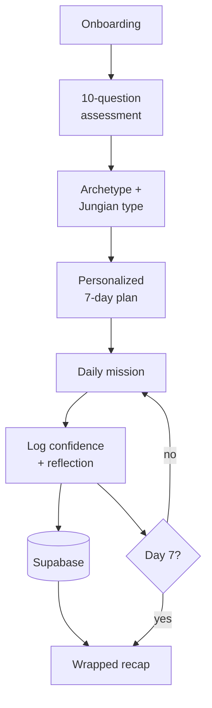

# Social Code

A Jungian-rooted social confidence app for people who know what to say but freeze before saying it.

**[Watch the full walkthrough (video)](https://youtu.be/5keLrlOZ4RY)**  
---

## The problem

Most social confidence advice assumes the problem is not knowing what to say. For a lot of people it isn't. They know exactly what to say and the words don't come out.

That's a different problem, and it doesn't respond to the same fix. Social Code starts by identifying *how* someone's anxiety actually shows up, then gives them missions calibrated to that specific pattern instead of generic advice.

---

## What it does

A 10-question assessment sorts each user on two axes: their **social archetype** (how their anxiety presents) and their **Jungian personality type** (how they process the world). Those two results drive everything after.

From there the user gets a 7-day challenge with one real-world mission per day, written for their archetype rather than pulled from a generic list. Each day they complete the mission, log a confidence score from 1 to 10, and write a reflection. Streaks track consistency.

On Day 7 they get a Wrapped-style recap built from their own numbers and their own reflections, so the progress is measurable rather than a feeling.

---

## Architecture

**React Native + Expo (SDK 54).** Expo handles the build and OTA update pipeline, which matters for a solo build where standing up native toolchains for two platforms isn't a good use of time.

**Expo Router** for file-based navigation, so route structure maps directly to the `app/` directory.

**Zustand** for state. Assessment results and mission progress need to be readable across most screens, and Zustand does that without the boilerplate Redux would add to an app this size.

**Supabase** for auth and Postgres. Row Level Security enforces access at the database layer rather than in client code.

**expo-av** for archetype video playback, **expo-notifications** for daily mission reminders.

---

## Data model

Two tables.

**`profiles`** — account details, first name, weekly goal, archetype and archetype scores, personality type and type scores, current streak, longest streak, current mission day, total missions completed.

**`mission_completions`** — one row per completed mission: mission day, confidence score (1–10), reflection text, timestamp.

Row Level Security is on for both. A user can only read and write their own rows, enforced by Postgres policy rather than application logic.

Keeping completions in their own table rather than as a counter on `profiles` means the Day 7 recap can be computed from the actual history, and confidence trends stay queryable over time.

---

## Archetypes

The assessment sorts users into one of four:

| Archetype | Pattern |
|---|---|
| **The Invisible** | In the room but not in the conversation |
| **The Performer** | Shows up, but it costs everything |
| **The Frozen** | Knows exactly what to say, then says nothing |
| **The Competent Man** | Becoming who he was always capable of being |

Each archetype gets its own variant of every daily mission plus a recorded video message.

---

## Frameworks

**Free tier**
- **FEARLESS** — the approach system (3-Second Scan, Barista Method, 3-2-1, Universal Openers)
- **SPARK** — conversation structure
- **TALK** — Tone, Attention, Language, Kinetics

**Premium tier**
- **BRAVE**, **SHIELD**, and the extended frameworks for the post-Day-7 experience

---

## Role

I'm the founding engineer — I own the technical architecture and implementation, working with a product owner on content and framework design." Then name the specific things: the assessment scoring logic, the Supabase schema and RLS policies, state management, the streak system, the recap screen.

Some difficulties included making the app secure, tracking and storing the data consistently, and handling edge cases regarding user input.

---

## Status

App will be available for download from IOS App Store and Google Play Store soon.

---

## Limitations

- No automated tests yet.
- Premium tier is scaffolded but not wired to payments.
- The assessment is self-reported, so results depend on honest answers. There's no calibration against observed behavior.
- Content is written for one audience. The archetype framing and mission design don't generalize past it without a rewrite.

---

## Tech stack

- **Mobile:** React Native, Expo (SDK 54), Expo Router
- **State:** Zustand
- **Backend:** Supabase (Auth, Postgres, Row Level Security)
- **Media & notifications:** expo-av, expo-notifications
